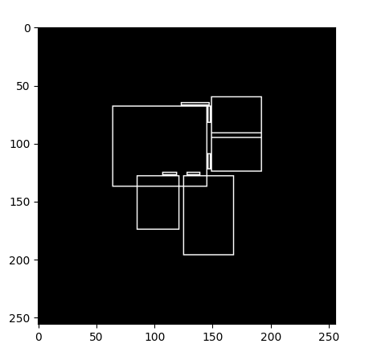

# CIVL5220 (Group13)

## Directories

```
.
├── 3rdparty
│   ├── housegan        # ennauata's housegan, we may take some code from it
│   └── houseganpp      # ennauata's newer version
├── housegan13          # our code, python only, I'm gonna start from here
├── overleaf            # put our overleaf documents
└── README.md
```

## Concepts

### Glossary

By default, consider HouseGAN++.

- **Bubble diagram**: A graph, whose nodes represent room type (including the room "outside") and edge represent doors.
- **RPLAN dataset**: A dataset from USTC, used by HouseGAN++: http://staff.ustc.edu.cn/~fuxm/projects/DeepLayout/index.html
- **Raster-to-Vector**, **Vectorization**: The algorithm used to convert raster images to vector graphics: http://art-programmer.github.io/floorplan-transformation.html
- **Room Mask**: 64x64 (32x32 in HouseGAN) signle-channel segment map (like those in instance segmentation), foreground (value > 0, perhaps) means this pixel is within the region of given room. The final generation result you see from the website and paper is a aggregation of the maps (i.e. room masks) of all input rooms.

## Data Structure

An example training data from: `3rdparty/houseganpp/data/json/7513.json`

```javascript
{
  // 14 rooms, each has a type
  "room_type": [3, 3, 2, 5, 4, 5, 1, 17, 17, 17, 17, 17, 17, 15],
  // box coord, range from [0, 256) (exclusive?)
  "boxes": [
    [51.0, 56.0, 96.0, 107.0],
    [78.0, 113.0, 124.0, 168.0],
    [159.0, 56.0, 205.0, 78.0],
    [192.0, 84.0, 205.0, 107.0],
    [159.0, 84.0, 186.0, 107.0],
    [130.0, 183.0, 186.0, 200.0],
    [102.0, 56.0, 186.0, 177.0],
    [195.0, 79.0, 205.0, 83.0],
    [114.0, 108.0, 126.0, 112.0],
    [97.0, 96.0, 101.0, 105.0],
    [154.0, 66.0, 158.0, 76.0],
    [154.0, 96.0, 158.0, 108.0],
    [137.0, 178.0, 179.0, 182.0],
    [137.0, 51.0, 149.0, 55.0]
  ],
  // box edge coord, together with room type and ?
  "edges": [
    [51.0, 56.0, 51.0, 107.0, 3, 0],
    [51.0, 107.0, 96.0, 107.0, 3, 0],
    [96.0, 107.0, 96.0, 56.0, 3, 1],
    [96.0, 56.0, 51.0, 56.0, 3, 0],
    [78.0, 113.0, 78.0, 168.0, 3, 0],
    [78.0, 168.0, 124.0, 168.0, 3, 0],
    [124.0, 168.0, 124.0, 113.0, 3, 0],
    [124.0, 113.0, 78.0, 113.0, 3, 1],
    [159.0, 56.0, 159.0, 78.0, 2, 1],
    [159.0, 78.0, 205.0, 78.0, 2, 5],
    [205.0, 78.0, 205.0, 56.0, 2, 0],
    [205.0, 56.0, 159.0, 56.0, 2, 0],
    [192.0, 84.0, 192.0, 107.0, 5, 0],
    [192.0, 107.0, 205.0, 107.0, 5, 0],
    [205.0, 107.0, 205.0, 84.0, 5, 0],
    [205.0, 84.0, 192.0, 84.0, 5, 2],
    [159.0, 84.0, 159.0, 107.0, 4, 1],
    [159.0, 107.0, 186.0, 107.0, 4, 0],
    [186.0, 107.0, 186.0, 84.0, 4, 0],
    [186.0, 84.0, 159.0, 84.0, 4, 0],
    [130.0, 183.0, 130.0, 200.0, 5, 0],
    [130.0, 200.0, 186.0, 200.0, 5, 0],
    [186.0, 200.0, 186.0, 183.0, 5, 0],
    [186.0, 183.0, 130.0, 183.0, 5, 1],
    [102.0, 56.0, 102.0, 107.0, 1, 3],
    [102.0, 107.0, 130.0, 107.0, 1, 3],
    [130.0, 107.0, 130.0, 177.0, 1, 0],
    [130.0, 177.0, 186.0, 177.0, 1, 5],
    [186.0, 177.0, 186.0, 113.0, 1, 0],
    [186.0, 113.0, 153.0, 113.0, 1, 0],
    [153.0, 113.0, 153.0, 56.0, 1, 4],
    [153.0, 56.0, 102.0, 56.0, 1, 0],
    [195.0, 79.0, 195.0, 83.0, 17, 0],
    [195.0, 83.0, 205.0, 83.0, 17, 5],
    [205.0, 83.0, 205.0, 79.0, 17, 0],
    [205.0, 79.0, 195.0, 79.0, 17, 2],
    [114.0, 108.0, 114.0, 112.0, 17, 0],
    [114.0, 112.0, 126.0, 112.0, 17, 3],
    [126.0, 112.0, 126.0, 108.0, 17, 0],
    [126.0, 108.0, 114.0, 108.0, 17, 1],
    [97.0, 96.0, 97.0, 105.0, 17, 3],
    [97.0, 105.0, 101.0, 105.0, 17, 0],
    [101.0, 105.0, 101.0, 96.0, 17, 1],
    [101.0, 96.0, 97.0, 96.0, 17, 0],
    [154.0, 66.0, 154.0, 76.0, 17, 1],
    [154.0, 76.0, 158.0, 76.0, 17, 0],
    [158.0, 76.0, 158.0, 66.0, 17, 2],
    [158.0, 66.0, 154.0, 66.0, 17, 0],
    [154.0, 96.0, 154.0, 108.0, 17, 1],
    [154.0, 108.0, 158.0, 108.0, 17, 0],
    [158.0, 108.0, 158.0, 96.0, 17, 4],
    [158.0, 96.0, 154.0, 96.0, 17, 0],
    [137.0, 178.0, 137.0, 182.0, 17, 0],
    [137.0, 182.0, 179.0, 182.0, 17, 5],
    [179.0, 182.0, 179.0, 178.0, 17, 0],
    [179.0, 178.0, 137.0, 178.0, 17, 1],
    [137.0, 51.0, 137.0, 55.0, 15, 0],
    [137.0, 55.0, 149.0, 55.0, 15, 1],
    [149.0, 55.0, 149.0, 51.0, 15, 0],
    [149.0, 51.0, 137.0, 51.0, 15, 0]
  ],
  // ?
  "ed_rm": [
    [0],
    [0],
    [0, 6],
    [0],
    [1],
    [1],
    [1],
    [1, 6],
    [2, 6],
    [2, 3],
    [2],
    [2],
    [3],
    [3],
    [3],
    [3, 2],
    [4, 6],
    [4],
    [4],
    [4],
    [5],
    [5],
    [5],
    [5, 6],
    [6, 0],
    [6, 1],
    [6],
    [6, 5],
    [6],
    [6],
    [6, 4],
    [6],
    [7],
    [7, 3],
    [7],
    [7, 2],
    [8],
    [8, 1],
    [8],
    [8, 6],
    [9, 0],
    [9],
    [9, 6],
    [9],
    [10, 6],
    [10],
    [10, 2],
    [10],
    [11, 6],
    [11],
    [11, 4],
    [11],
    [12],
    [12, 5],
    [12],
    [12, 6],
    [13],
    [13, 6],
    [13],
    [13]
  ]
}
```

### Room Type

Each room has a room type.

According to (here)[https://github.com/ennauata/houseganpp/blob/main/misc/utils.py], room types are:

```python
{
 'living_room': 1,
 'kitchen': 2,
 'bedroom': 3,
 'bathroom': 4,
 'balcony': 5,
 'entrance': 6,
 'dining room': 7,
 'study room': 8,
 'storage': 10,
 'front door': 15,   # the door connects room and outside
 'unknown': 16,
 'interior_door': 17 # the door connects rooms
 }
```

🤔, some numbers are somehow skipped, there is only **12** classes, including **10** room types and **2** door types.

### Boxes

Each room has a **axes-aligned** (i.e. either horizontal or vertical) box, represented by pixels within 256x256 canvas.

By drawing the boxes from the above sample on a `256x256` canvas, we can get:



## Notes

- For Python formatter, I prefer [black](https://github.com/psf/black.git), it is easy to use and consistent.
